#Neural Turing Machine
##Introduction and Overall Architecture

<a href="https://arxiv.org/abs/1410.5401">Neural Turing Machines (NTM)</a> can be basically viewed as a machine with simple regular computer architecture, which consists of a controller, memory, and read/write heads, shown as below. The controller, which is made out of neural network (LSTM and feedforward network), makes decisions, takes actions and outputs depending on external input and information read from memory. Meanwhile, parameters of read/write heads and contents stored in memory are updated according to controller decisions.

  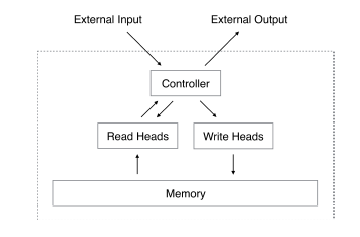

Ideally, NTM can accomplish whatever tasks a general computer is capable of. The main difference between NTM and computers is mechanism set up for controller decisions and actions. In computer, controller (CPU) is designed manually by engineers. Instruction set and a variety of computing method (e.g. add, floating point) are embedded into controller to cope with commands from users. On the other hand, design in NTM controller only associates with architecture of neural network used inside. Strategies while confronting problems are not defined explicitly by engineers but can be learned through feeding input output pairs. In other word, ultimately, NTM can learn algorithms which may or may not be designed and developed by human. 
Furthermore, NTM is a neural network with memory. NTM has a explicitly-defined memory space, in which we can seperate “thinking” from “memory”, which is much similar to human brain. Also, apart from LSTM RNN, where memory is located implicitly and distributedly in the hidden state of each LSTM cell, centralized management over memory of NTM, in some cases, enjoy much faster training process. In certain intuition, imagine that we want to know the name of the host in a party. We can either try hard to learn from the hustle or simply jusk ask a person. 

##Read/Write Operation
###Read

With normalized weighting vector Wt, we will get

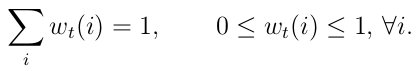

If we have a row vector Mt in memory, then we define the read vector by multipliation with weighting vector and memory vector:

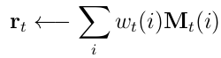

then rt is data we get.

###Write

When we want to write data into memory, we split writing into two parts: erase and add operation. First, we will erase data in memory with an erase vector et:

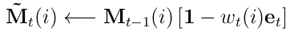

Mt bar is the erased memory based value and we will add it by an add vector:

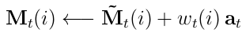

The Mt will be the final value stored into memory.

##Addressing

In the previous part, we talked about the process of reading and writing of the memory. In this part, we will discuss about 
how the weight is produced to address the memory. There are two types of addressing: 

###Content based

Content based addressing relies on similarity between the output of controller and the content in the memory. As a result, it is relatively simple. 

###Location based

Location based is used in arithmatic operation. Since the content in such variable is arbitrary, the variable name is the one 
matters. Thus, similarity is of no use here.  

In Neural Turing Machine, it combined two types of addressing machanism to produce the weighting vector. The system flow diagram:

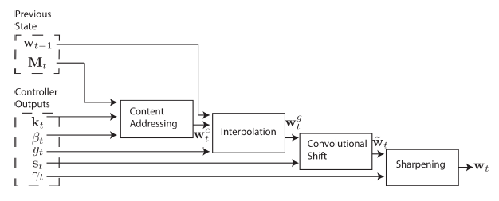

###Content Addressing

In content addressing, we compare the output vector of controller with all the vectors stored in the memory.

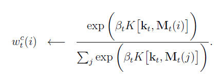

kt is the output vector, ßt is a scalar deciding the precision of the focus, and K is the function producing cosine
similarity(like vector inner product):

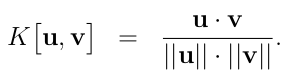

This part can be viewed as producing a probabilty distribution of whether kt would be in certain location.  The effect
of scalar ßt is illustrated in the picture below:

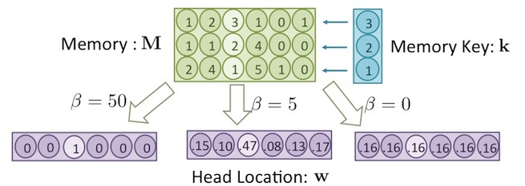

###Interpolation

Take the weight of current time step(produced by content addressing part) and the weight of previous time step as inpu
t, we perform interpolation based on the scalar gt(interpolation gate):

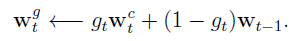

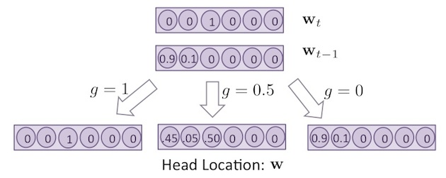

###Convolutional Shift

In previous part, we focused more on content based addressing. If gt  is relatively samll, the effect of weight produc
ed in current time step has less influence. Thus we can view this part as performing location based addressing.
 Take st vector produced by controller as input, it performs circular convolution on the weight sent from 
interpolation part:

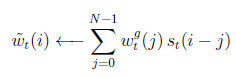

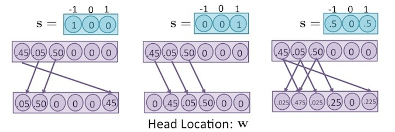

###Sharpening

After convolutional shift part, the probability distribution is changed again. As a result, in the last part, we 
should adjust the the final result by sharpening

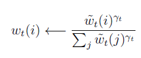

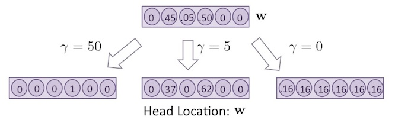

##Controller

Controller is a neural network which will generate the representation that is used by read and write heads. Controller can be either a feed-foward network or a RNN.

###Type1, Feed-Forward

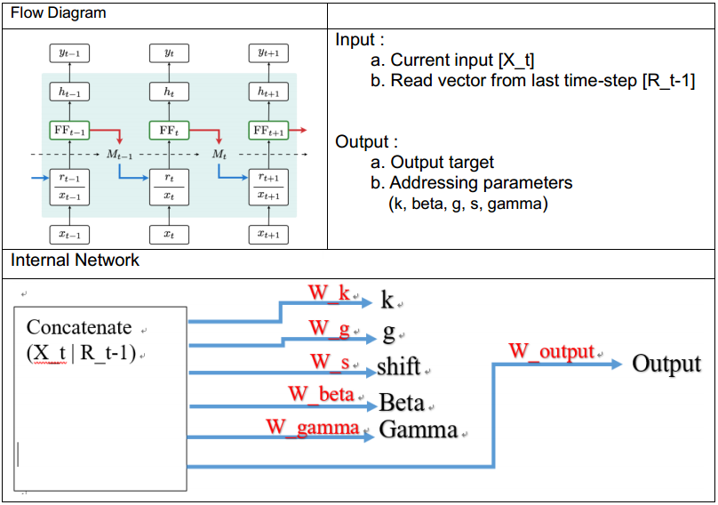

###Type2, RNN(LSTM)

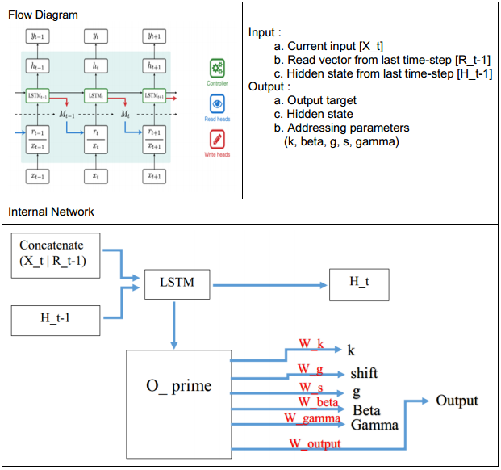

##Property and Application
###Property
<ul>
<li><strong>Flexibility</strong></li>

Since neural turing machine can learns general concepts and algorithms, we can feed input output pair associated with a variety of tasks as long as the controller architecture contain sufficient computational capability over certain algorithm or concepts.

<li><strong>External Memory</strong></li>

Unlike LSTM, whose memory is distributedly stored in each LSTM cell, neural turing machine seperates memory from controller and thus centralizes management over memory. This design benifits longer term memory and faster training.

<li><strong>Addressing Mechanism</strong></li>

Addressing paramemters are hand-crafted parameters, and one can design his own parameters to reach the requirment.

</ul>
###Usage
<ol>
<li>
In the concept of turing machine, it can perform various tasks and it is the prototype of the computers. Computers need to be programed so that they can achieve the desire missions. Instead of being programed, neural turing machine can learn these tasks like the way our brains do. As a result, with enough capability, neural turing machine can become the neural net version computer whose architecture of controllers may have more potential to simulate human brains rather than manully-designed computational units.
</li>
<li>
GGG
</li>
</ol>

